# Data

A highly controllable dataset w.r.t. Illumination is OpenIllumination [oppo-us-research.github.io](https://oppo-us-research.github.io/OpenIllumination/).
It allows us to control, for a matrix of camera views
$$
\begin{bmatrix}
A1 & A2 & A3 & A4 & A5 & A6 \\
& B2 & B3 & B4 & B5 & B6 \\
C1 & C2 & C3 & C4 & C5 & C6 \\
D1 & & D3 & D4 & D5 & D6 \\
\end{bmatrix}
$$

a mixture of up to 142 point lights, by providing OLAT (one light at a time) images for all views and lights. Such mixtures are not exact, as we convert from JPG sRGB to linear color space to perform the mixing then back to sRGB.

  

    An example of the same camera track (A1, ..., A6) under distinct lighting mixtures.
  

  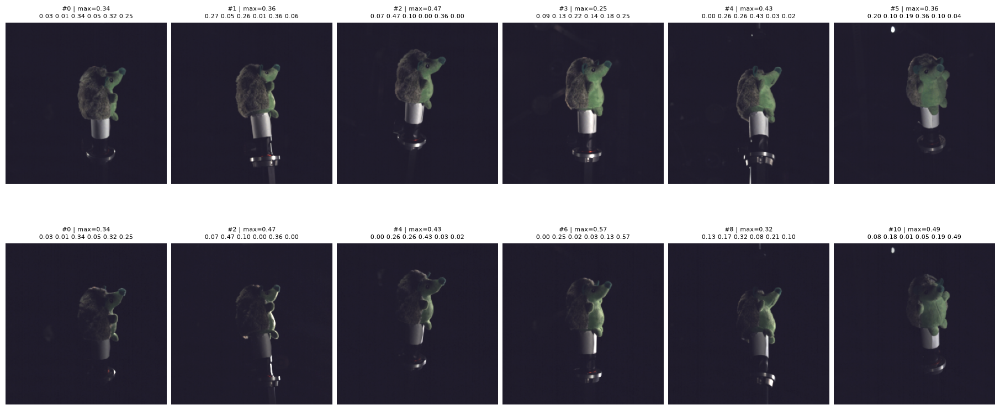

  

    Two example light mixtures across different objects.
  

  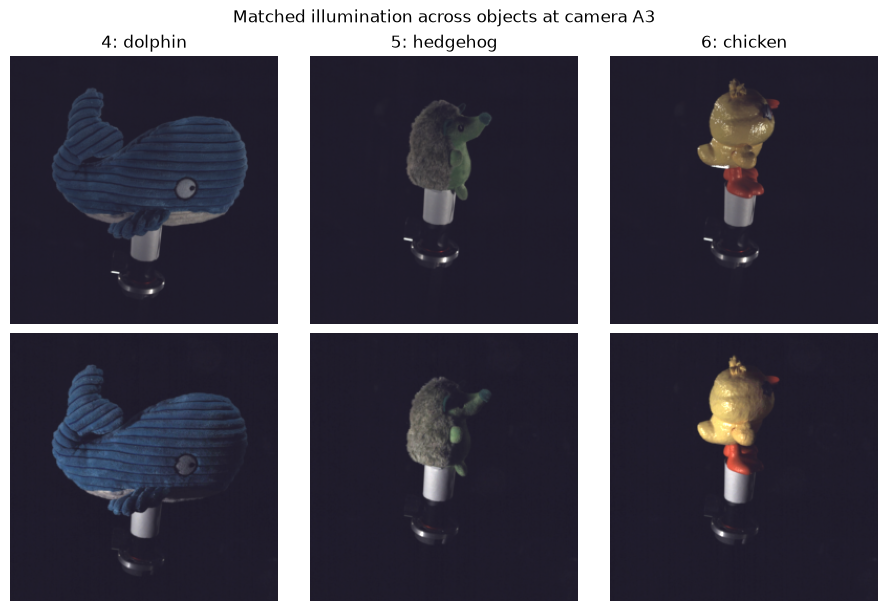

_It is to be noted_ that **the authors explicitly highlight** that this kind of input, with no tangible background, does to a large degree lie out-of-distribution for the model. Therefore it is expected that the pose-estimation capability of the model suffers in this context. Further input-augmentation could perhaps alleviate this effect in conjunction with other, diversely illuminated, data sources that should also be investigated.

# Measurements
## Single view linear probing

This does not establish a separable representation of illumination in the latent, but it gives us a very coarse idea of a correspondence between representation and illumination. Specifically, whether a fixed low dimensional illumination geometry can be inferred from a representation.

Fix a rig of 6 lights oriented such that they are roughly evenly distributed across the sphere around the central object.

  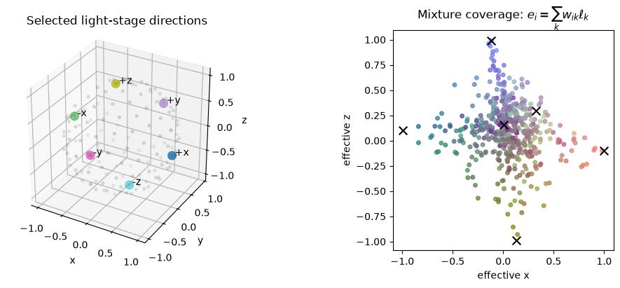

Then sample light intensities from some distribution $P$. We sample from 4 families of Dirichlet distributions ranging from concentrated lighting to diffuse lighting over these fixed 6 lights.

A normalized lighting mixture produced by linear combination of $N$ individual OLAT images, lies inside the corresponding simplex of at most dimension $N-1$ in linear RGB pixel space. With a low dimensional lighting setup of 6 lights, a light mixture can be predicted by a linear regression on the pixels of the image essentially perfectly.

By similarly fitting a ridge-regression on the representations produced by a neural model, we roughly measure how well that almost perfect identifiability of a light mixture in pixel space is available in the compressed representation.
For representations $r_\text{dynamic} \in \mathbb{R}^{256}$, $r_\text{backbone} \in \mathbb{R}^{1024}$ and $r_\text{DINOv3} \in \mathbb{R}^{1024}$ as well as the raw pixels, we fit a linear probe from representation to light mixture $\omega$ using ridge regression and measure held-out $R^2$ / MAE. Here $r_\text{dynamic}$ is RayDer's nuisance state, while $r_\text{backbone}$ is the post-norm vector from the camera pose head. The ridge probe predicts the first five mixture weights; $w_6=1-\sum_{k=1}^5w_k$ is implied. One fixed 80/20 split is shared by all representations, and ridge strength is selected only on the training set.

|  representation | ridge $R^2$ | ridge MAE |
| --------------- | -------- | --------- |
| RayDer backbone token |    0.998 |    0.0059 |
| RayDer dynamic  |    0.997 |    0.0071 |
| DINOv3          |    0.972 |    0.0185 |
| Pixels          |    1.000 |     1e-17 |

**We find that all representations allow us to decode a light mixture of fixed low dimensional geometry with very high precision.**

## Cross View & Cross Object linear probe transfer

In order to investigate potential already existing cross-object or cross-view transfer capabilities we further measure not only over held-out light mixtures, like above, but additionally held-out views and held-out objects.
For this purpose a calibration representation is constructed for every (object, view) pair.
The calibration representation $z_{ov}(\omega_0)$ is the encoding of object $o$ from some subset of views $v \subseteq \{A_1, \dots, A_6\}$ under the uniform light mixture $\omega_0 = \langle 1/6, \dots, 1/6 \rangle$.

The prediction target for a representation $z_{ov}(\omega)$ is the coordinate $q(\omega) = (\omega - \omega_0)^\top H$: The mixture $\omega$ in an orthonormal basis H, centered at uniform illumination.
Let the absolute representation of object $o$ from view(s) $v$ under lighting $\omega$ be $z_{ov}(\omega)$. Then we call $z_{ov}^\text{anchor}(\omega) = z_{ov}(\omega) - z_{ov}(\omega_0)$ the anchored representation of $z_{ov}(\omega)$.
The prediction is obtained, like above, by fitting a linear probe using ridge regression on an 80/20 split shared across all representations.
This single affine ridge probe $f(z)=W^\top z+b$ is trained on the absolute representations.
In anchored/reference-calibrated evaluation the probe stays frozen and predicts
$
f(z_{ov}(\omega))-f(z_{ov}(\omega_0)) = W^\top(z_{ov}(\omega)-z_{ov}(\omega_0))
$.

Evaluated are the following scenarios:

| objects | views | measurement |
|---|---|---|
| source | source | mixture-only control |
| held out | source | object transfer |
| source | held out | view transfer |
| held out | held out | joint object + view transfer |

We measure for both the "absolute" representations $z_{ov}$, as well as the anchored "relative" representations $z_{ov}^\text{anchor}(\omega)$. Where applicable, like in the case of RayDer, we measure contextual representations, where the model has jointly seen multiple views of the object under some illumination $\omega$ and independent representations where the same views are shown separately to the model.

It appears that all representations support accurate mixture decoding when object and view are fixed, but none supports joint object-view transfer through a shared linear probe on average. Reference anchoring reduces error substantially, yet $R^2$ remains negative. The contextual RayDer backbone tokens transfer least poorly, while the nuisance state measures worst in this transfer regime.

| representation                 | absolute R2 | anchored R2 |  absolute MAE |  anchored MAE |
| ------------------------------ | ----------- | ----------- | ------------- | ------------- |
| RayDer token - independent     |     -17.293 |      -2.393 |        0.4995 |        0.2088 |
| RayDer token - context         |      -4.559 |      -0.271 |        0.2950 |        0.1330 |
| RayDer nuisance - independent  |     -53.376 |      -9.889 |        0.7901 |        0.3302 |
| RayDer nuisance - context      |     -21.916 |      -4.182 |        0.5481 |        0.2522 |
| DINOv3 - per image             |      -2.982 |      -0.357 |        0.2646 |        0.1404 |
| linear OLAT pixels             |     -13.045 |      -4.782 |        0.3322 |        0.2043 |

Notably, the pixel probe is not expected to predict well in this regime. Important to observe are its relative difference to the neural representations. Together with the failed nuisance-state probe, this supports the interpretation that illumination affects the nuisance state primarily through view-specific residual appearance.
A more detailed measurement matrix can be found in (Figure A1) at the very end of the document.
Also, an evaluation in which the ridge probe was fitted on anchored representations rather than absolute ones was performed. The result is appended in (Table A1) at the very end of the document. It does not substantially impact the above.

# State Transplantation

Given the above result it seems unlikely that direct cross-view state transplantation could provide useful relighting without additional alignment. To check this we construct a routine similar to the anchored transfer measurement above but w.r.t. transplanted states. A relative lighting change observed at a donor view is injected into a different target view through RayDer's nuisance state.

For equal-weight illumination $\omega_0$, donor view $v_d$, target view $v_t$, and mixture $\omega$, define

$$\Delta s_{d,\omega}=s_{v_d,\omega}-s_{v_d,\omega_0}, \qquad s^{rel}_{t,\omega}(\lambda)=s_{v_t,\omega_0}+\lambda\Delta s_{d,\omega}.$$

$\Delta s_{d,\omega}=s_{v_d,\omega}-s_{v_d,\omega_0}$ is the change in nuisance representation caused by a change in illumination between target $\omega$ and uniform $\omega_0$ as observed at the donor view.
The relative state $s^{rel}_{t,\omega}(\lambda)$ scales and adds that donor observed change to the target view under uniform lighting.
The primary relative intervention is $\lambda=1$. Alongside this, the absolute intervention $s^{abs}_{t,\omega}=s_{v_d,\omega}$ directly supplies the donor view under target lighting. The absolute intervention is conceptually equivalent to Appendix B's state transplantation evaluation.

Camera extrinsics and intrinsics are first inferred jointly by RayDer from all six views under uniform lighting and then held fixed throughout the experiment.
The different state interventions are then evaluated over several of the OpenIllumination objects, rendered under samples of lighting mixtures from the earlier mentioned 4 dirichlet distribution families.

  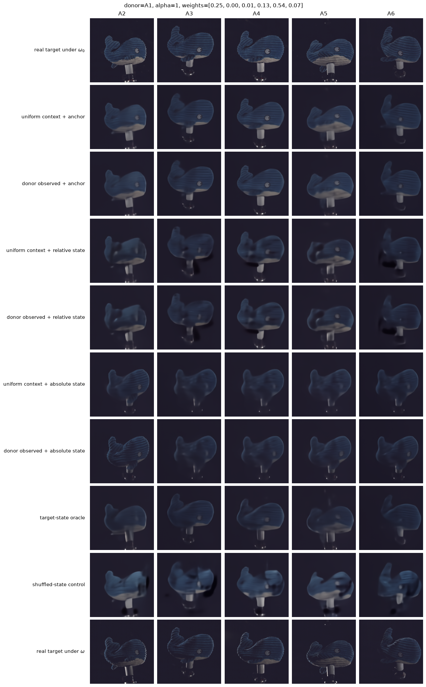
  

  Decodings of object 4 from views A2, ..., A6. The donor view is A1. Weights indicate the exact light mixture weights used to obtain the real target image.
  

The rows in the above figure differ in the following main ways.

| Grid row | Decoder image context | state target |
| -- | -- | -- |
| uniform context + anchor          | Five non-target views under uniform light $\omega_0$   | $s_{t,\omega_0}$                               |
| uniform context + relative state  | Same five uniform views                                | $s_{t,\omega_0} + s_{d,\omega}-s_{d,\omega_0}$ |
| uniform context + absolute state  | Same five uniform views                                | $s_{d,\omega}$                                 |
| donor observed + anchor           | Same context, except A1 is replaced by $I_{d,\omega}$  | $s_{t,\omega_0}$                               |
| donor observed + relative state   | Same donor-observed context                            | $s_{t,\omega_0} + s_{d,\omega}-s_{d,\omega_0}$ |
| donor observed + absolute state   | Same donor-observed context                            | $s_{d,\omega}$                                 |
| target state oracle               | Same donor-observed context                            | $s_{t,\omega}$                                 |

We can observe that under an absolute transplant the model seems to reproduce the donor view at various levels of sharpness but not the requested target view. Under the relative transplant, qualitatively, the output appears to contain a blurred, subtraction-like imprint of the donor view. Cross-fading between the decoding of the target view and the observed donor view using a scaled up relative contribution $\lambda \Delta s_{d,\omega}$ with $\lambda \in [1.5, 2.0]$ illustrates this somewhat as shown in the gif below. This is an interpretative extrapolation of the result not a direct inference one can make from it, or a strongly tenable claim about the semantics of the nuisance representation.

  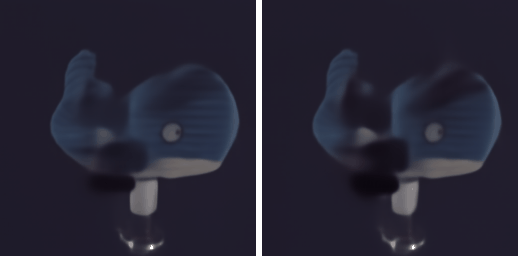

Animation blending between observed donor image and decoding of transplant in pixel space. This intends to make residual donor-view structure easier to see.

An additional figure that shows how different scales $\lambda$ for the relative state contribution affect decoding results can be found at the very end of the document (Figure A2).

# AdaRMSNorm post-adaptation

We test one intentionally minimal post-training modification to the model.
Inspired by [LumiTokens](https://arxiv.org/abs/2608.18215) we introduce an additional conditioning that encodes a restricted representation of illumination, a single gaussian lobe, using its mean world-space direction $\mu = [ \mu_x, \mu_y, \mu_z ]$, its extent as an angular standard deviation $\sigma$ and its energy $E$.
$$x_\ell = (\mu, \log \sigma, \log E)$$

This condition is inserted as an additional residual scale on the adaptive RMSNorms of the Transformer layers however, not as a token sequence like in LumiTokens.
The dataset used for this adaptation consists of only 9 OpenIllumination objects. Each rendered under 256 randomly sampled gaussian lobes with a constant 10% energy background illumination from all available lights. The constant background avoids entirely black shadow regions.
There are 17 available views (full camera tracks A, B and C) of which one random view is held out entirely for each training object. Two objects are held-out from training completely and are reserved for testing.
The gaussian lobe that is sampled is approximately realized by projecting the 142 available point lights onto it. So there is only a single gaussian light source per datapoint, which is only approximately represented, there are no backgrounds as would be observed during pretraining, and the number of available views is comparatively limited, while the number of objects is substantially limited. All this makes the experiment a targeted feasibility check rather than a rigorous or extensive attempt at creating a general scene transferable light conditioning.

## Implementation

Since RayDer is already conditioned using RMSNorms we insert a lighting residual parallel to the existing conditioning on that same path.

The requested light representation $x_\ell$ is projected by a newly inserted two-layer MLP into a 128 dimensional feature once.
Zero initialized linear projections then add a scale residual to every adaptive RMSNorm.

$$z_\ell = MLP(x_\ell)$$

$$c_\ell^{(i)} = A_\ell^{(i)} z_\ell$$

Where $c_\ell^{(i)}$ is the light specific residual at layer i and $A_\ell^{(i)}$ its feature projector.
The modified AdaRMSNorm becomes:

$$RMSNorm(x, 1 + L^{(i)} x_\text{cond} + c_\ell^{(i)})$$
where $L^{(i)} x_\text{cond}$ is the existing adaptive linear conditioning.

This light-specific modulation is only applied to target/rendering tokens and it does not apply to camera estimation tokens or source-view tokens.

A training example consists of three source views under the same lighting distribution $\ell_s$ as context and the corresponding target view under $x_{\ell_t}$.
In order to resemble the pretraining environment on camera conditioning, we let the model infer the camera pose on all views under the source illumination.

We only know ground truth illumination coordinates $\mu$ in OpenIlluminations world space, but the camera pose of the target is inferred in RayDer's world coordinates. Therefore, we estimate a best fit transform Q that can move $x_\ell$ into RayDer's inferred coordinate system by a least squares fit in SO(3) implemented via singular value decomposition.
Each inferred camera pose suggests a:
$$Q_i = R_i^\text{inf}(R_i^\text{cal})^\top$$
where $R_i^\text{inf}$ is the inferred rotation and $R_i^\text{cal}$ is the calibrated dataset rotation of the camera.
$$
  M = \sum_i R_i^\text{inf}(R_i^\text{cal})^\top
$$

$$
  M = U\Sigma V^\top
$$

$$
  Q = U\operatorname{diag}(1, 1, \det(UV^\top))V^\top
$$

Is then the best fit rotation applicable to the mean light direction $\mu$ in calibrated coordinates, that moves it to RayDer's coordinate frame, corrected for reflection.

Two out of the 9 objects are held out entirely for testing (ID 12 and 20). All other objects have a random single view held-out as mentioned.

The model is trained on minimizing the objective:
$$L = L_{\mathrm{target}} + \gamma L_{\mathrm{source}} + \beta L_\Delta + \lambda L_\text{perceptual}$$
where
$$L_\Delta = \operatorname{SMSE} \left(\hat I_{\ell_t}-\hat I_{\ell_s}, I_{\ell_t}-I_{\ell_s} \right)$$
where $\hat I_{\ell_t}$ and $\hat I_{\ell_s}$ are the model predictions for target and source images respectively.
$\operatorname{SMSE}$ describes the masked MSE:
$$
\operatorname{SMSE}(\hat I,I;m)
=
\operatorname{MSE}_{m}(\hat I,I)
+
\eta\,\operatorname{MSE}_{\neg m}(\hat I,I)
\qquad \eta=0.05
$$
Where background non-mask regions are intentionally scaled back heavily from contributing to the loss, according to object masks OpenIllumination provides.

$L_\text{target}$ and $L_\text{source}$ are the masked $SMSE$ for target and source respectively.
$L_\text{perceptual}$ is an optional perceptual loss, the default configuration is $\lambda = 0$.

## Results

We find that using this method the model appears to learn a very coarse light target condition.
Apparently mainly through diffuse modulation of color, intensity and some spatial position.

  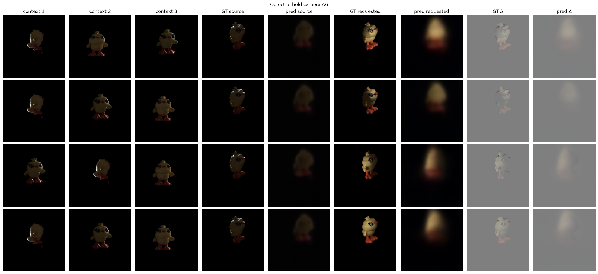

In-distribution metrics show:

| Metric | Zero-init | Adapted | Change |
| -- | -- | -- | -- |
| Target MSE | 0.0515 | 0.0193 | −62.6% |
| Difference MSE | 0.0542 | 0.0264 | −51.4% |
| Target PSNR | 13.22 dB | 17.54 dB | +4.33 dB |
| Correct-light top-1 | 12.5% chance | 42.9% | 6/14 cases |

"Zero-init" refers to the model with a silenced light conditioning path. "Adapted" to the one where light conditioning can modify the norm scale.
Correct-light top-1 is measured by comparing decodings of several distractor light conditionings on the target view to the ground truth view through MSE. By ranking using $MSE(pred_{\omega_i}, view_\omega)$ we can obtain a sort of top-k accuracy over the model.
In other words, this measures whether no tested wrong light condition produced an image closer to the requested target than the correct light condition did.
Mean rank on in-distribution objects is ~1.92.

For held-out objects the model obtains a top-1 of 50% over 16 cases with a significantly worse mean rank of 4.5. Object 12 appears to be an especially difficult case with only 25% top-1 and mean rank 7.

  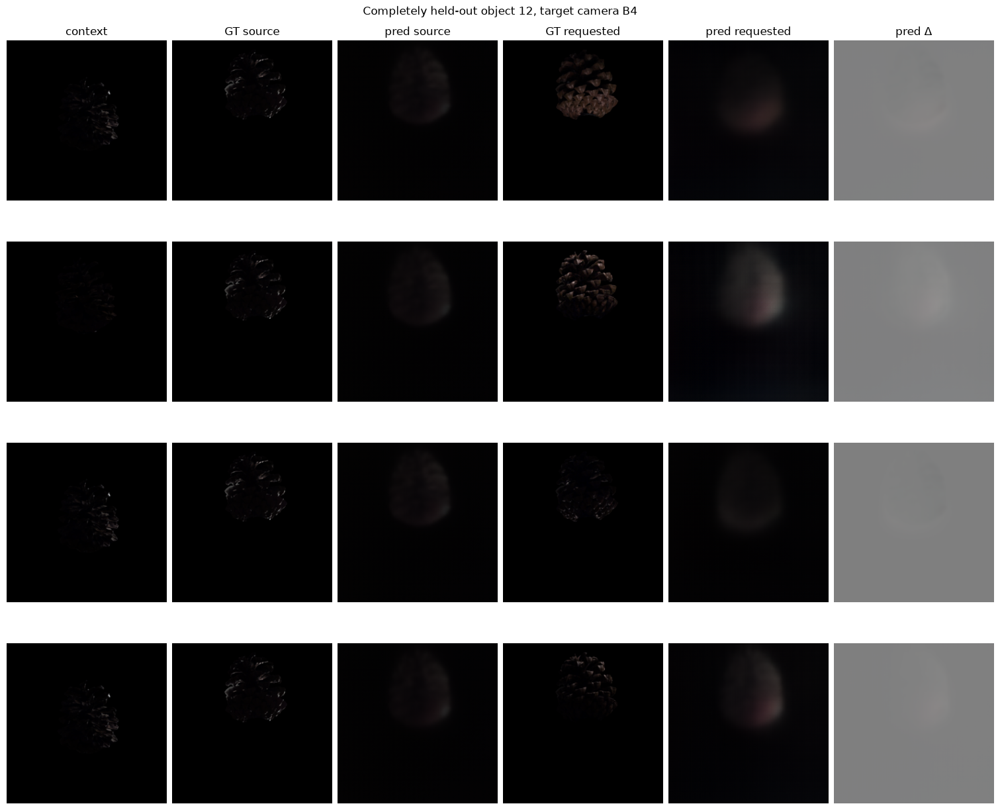

  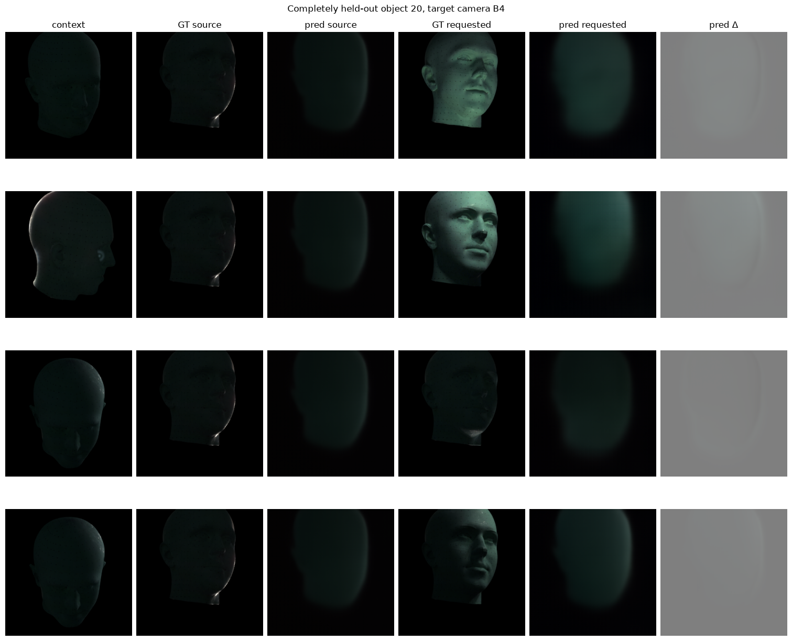

A qualitative evaluation of NVS capability retention when modulating adaptive normalization scales shows two qualitative effects:
1. How far out-of-distribution OpenIllumination already is.
2. That NVS fidelity is substantially impacted by naive normalization modulation especially w.r.t. sharpness.

  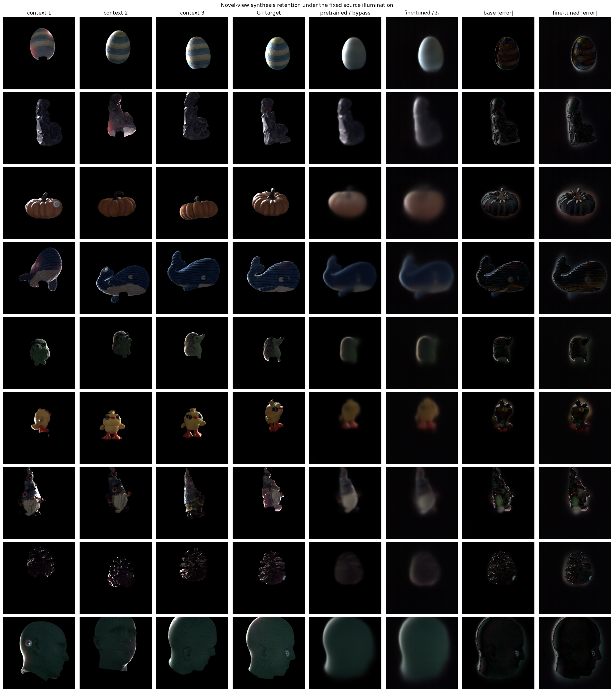

## Addition of perceptual loss

When additionally using a perceptual loss $L_\text{perceptual}$ : LPIPS at scale $\lambda = 0.05$, structural fidelity can empirically be retained better.

  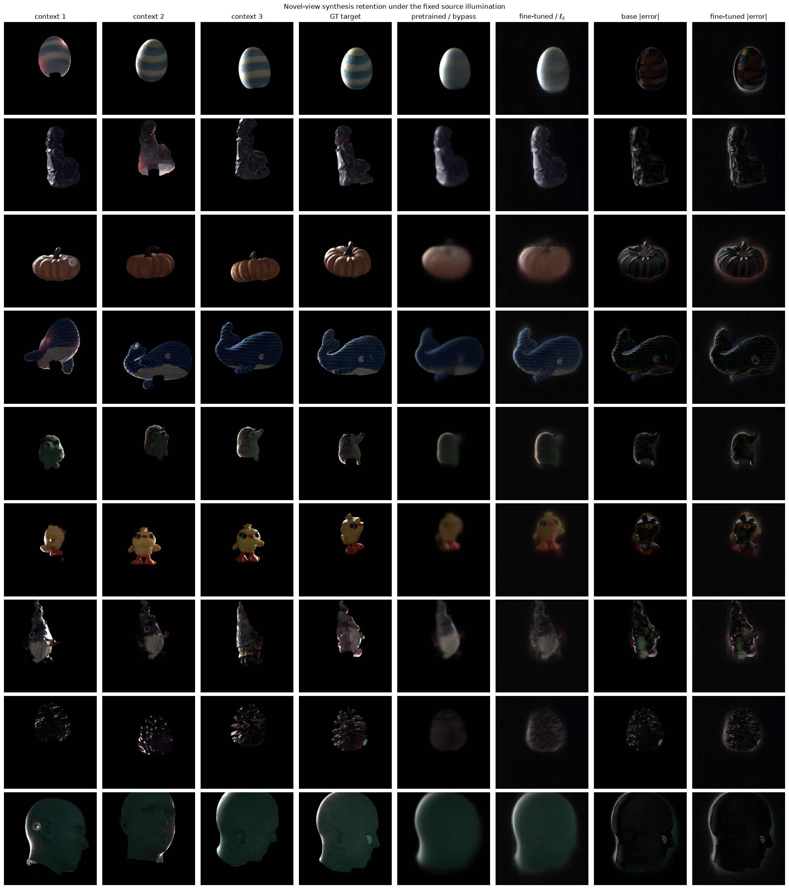

In-distribution metrics also improve slightly with the additional perceptual loss:

| Metric              | Zero-init    | Adapted  | Change      | Change over MSE-only |
| ------------------- | ------------ | -------- | ----------- | -------------------- |
| Target MSE          | 0.0515       | 0.0178   | −65.5%      | -2.9%                |
| Difference MSE      | 0.0542       | 0.0229   | −57.7%      | -6.3%                |
| Target PSNR         | 13.22 dB     | 17.91 dB | +4.69 dB    | +0.36dB              |
| Correct-light top-1 | 12.5% chance | 71.4%    | 10/14 cases | +28.5%               |
| perceptual_loss     | 0.765        | 0.646    | -15.5%      | -                    |
| perceptual_source   | 0.446        | 0.363    | -18.7%      | -                    |
| perceptual_target   | 0.542        | 0.465    | -14.2%      | -                    |

Out-of-distribution metrics remain approximately identical, with top-1 50% as before and mean rank 4.75 as opposed to 4.5 before. The difference stems from object 12 degrading slightly in terms of mean rank, from 7 to 7.5.

## Affine Oracle Baseline

Lastly, a deliberately strong baseline is compared against the adapted model.
An affine linear transform is fit from pixels to three global RGB gains and three biases.
This baseline sees the target view under source illumination as decoded by the model and is therefore advantaged over adapted RayDer in evaluation. It however can only produce a color and intensity shift on the image. The interpretation of this baseline is therefore: Can the learned predictor outperform the best possible global per-channel brightness and color adjustment?

|object|camera|learned MSE|affine oracle MSE|learned < oracle |
| -- | -- | -- | -- | -- |
| 12 |	A4 |	0.005734 |	0.003278 | ❌ |
| 12 |	A4 |	0.008136 |	0.005349 | ❌ |
| 12 |	B4 |	0.008813 |	0.002946 | ❌ |
| 12 |	B4 |	0.008856 |	0.002117 | ❌ |
| 12 |	C4 |	0.010593 |	0.001469 | ❌ |
| 12 |	C4 |	0.009625 |	0.001024 | ❌ |
| 20 |	A4 |	0.005011 |	0.006478 | ✅ |
| 20 |	A4 |	0.015695 |	0.014986 | ❌ |
| 20 |	B4 |	0.008599 |	0.009522 | ✅ |
| 20 |	B4 |	0.011268 |	0.007908 | ❌ |
| 20 |	C4 |	0.007863 |	0.008105 | ✅ |
| 20 |	C4 |	0.006073 |	0.005128 | ❌ |

| mean learned MSE | mean affine oracle MSE |
| -------------------- | -------------------------- |
| 0.008855             | 0.005692                   |

# Additional Figures

  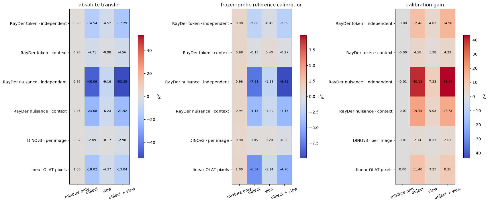
  
Figure A1: R² of independent and contextualized inference of illumination under different held-out data.

  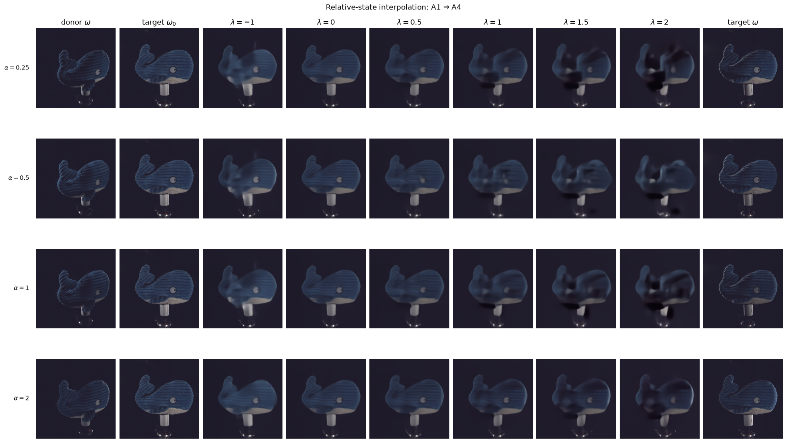
  
Figure A2: Interpolation between donor state and anchored target state. At the very left are the ground truth sources and on the very right the intended targets. In between the model decodes various linear combinations of the target state under uniform light and the donor's relative state under the intended light.

 

### Table A1:

Refitting on anchored representations $z_{ov}^\text{anchor}(\omega) = z_{ov}(\omega) - z_{ov}(\omega_0)$.
RayDer nuisance features benefit meaningfully from refitting. $R^2$ improves by 2.05/0.74 and MAE drops. Their domain offsets evidently
interact more strongly with the lighting-sensitive feature directions.
RayDer token features are effectively unchanged.
Apparently most of the benefit comes from subtracting the target-domain reference at evaluation time. Relearning the probe on anchored source features adds little for token and DINO representations, but helps the nuisance representations somewhat.

representation                   | frozen R2 | refit R2 |   delta | frozen MAE | refit MAE |
|--|--|--|--|--|--|
RayDer token - independent       |    -2.391 |   -2.301 |   0.090 |     0.2087 |    0.2094 |
RayDer token - context           |    -0.271 |   -0.249 |   0.022 |     0.1330 |    0.1327 |
RayDer nuisance - independent    |    -9.888 |   -7.836 |   2.051 |     0.3302 |    0.3126 |
RayDer nuisance - context        |    -4.182 |   -3.438 |   0.744 |     0.2522 |    0.2369 |
DINOv3 - per image               |    -0.357 |   -0.267 |   0.090 |     0.1404 |    0.1345 |
linear OLAT pixels               |    -4.782 |   -5.257 |  -0.474 |     0.2043 |    0.2074 |